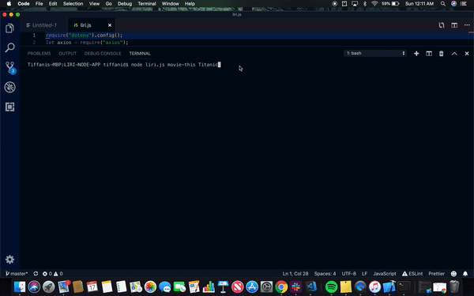

Liri-Node-App
=============
Liri is simple command line application created to help you find your favorite songs on spotify or a movie you really enjoy! Maybe you'd like to see a new band you found on spotify. That's a possibility with Liri!

Commands
--------
* spotify-this-song
* concert-this
* movie-this
* do-what-it-says

Instructions
------------
To run the application, simply navigate to the liri.js file in terminal. Then run -- `node liri.js <command> <userinput>`.

API's Used
----------
* [Spotify](https://developer.spotify.com/documentation/web-api/)
* [OMDB](http://www.omdbapi.com/)
* [BandsInTown](http://www.artists.bandsintown.com/bandsintown-api)

Packages Used
--------------
* axios
* figlet
* chalk
* node-spotify-api
* moment
* fs

Spotify Command
================

OMdB Command
=============

BandsInTown Command
====================

